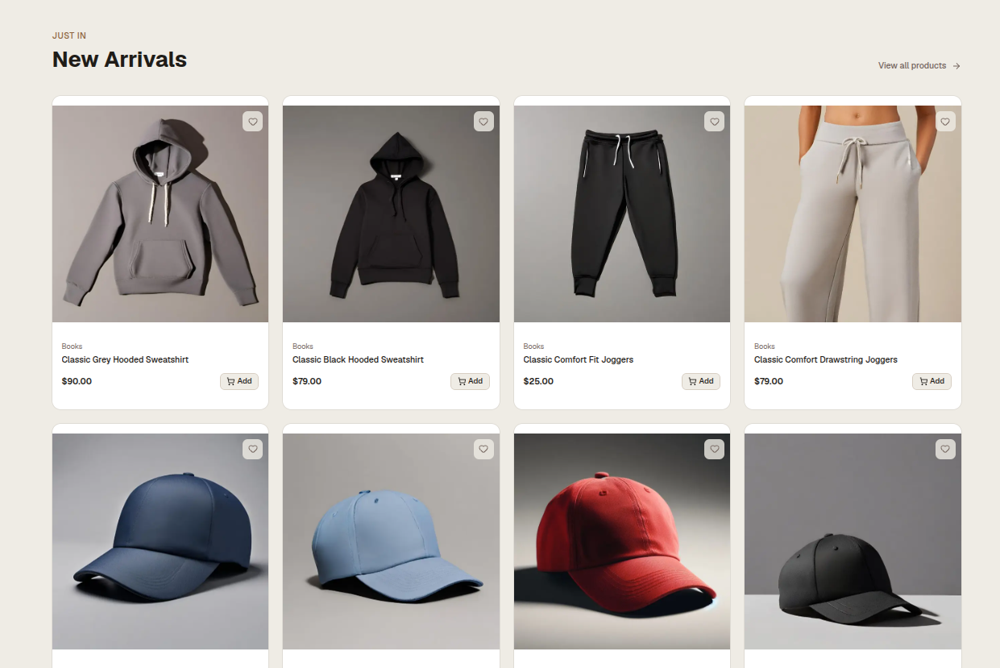
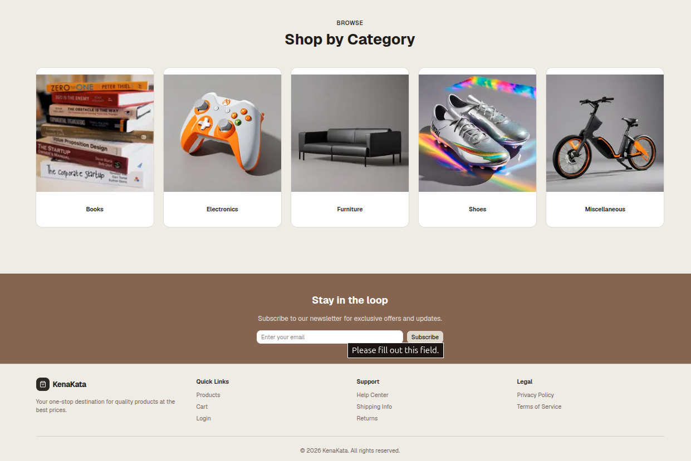
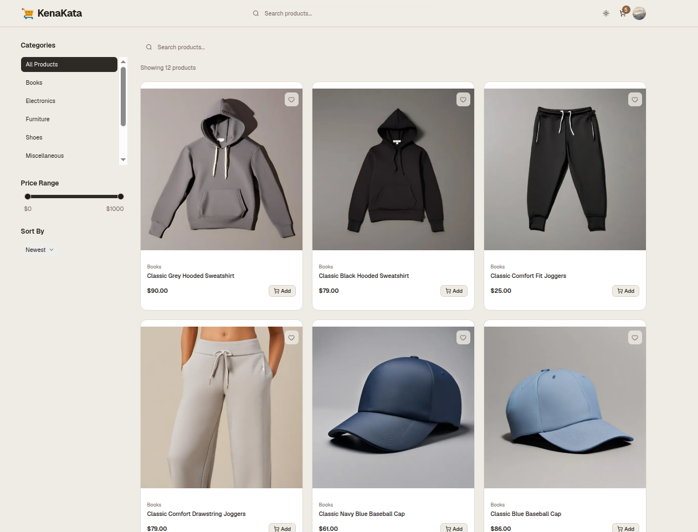
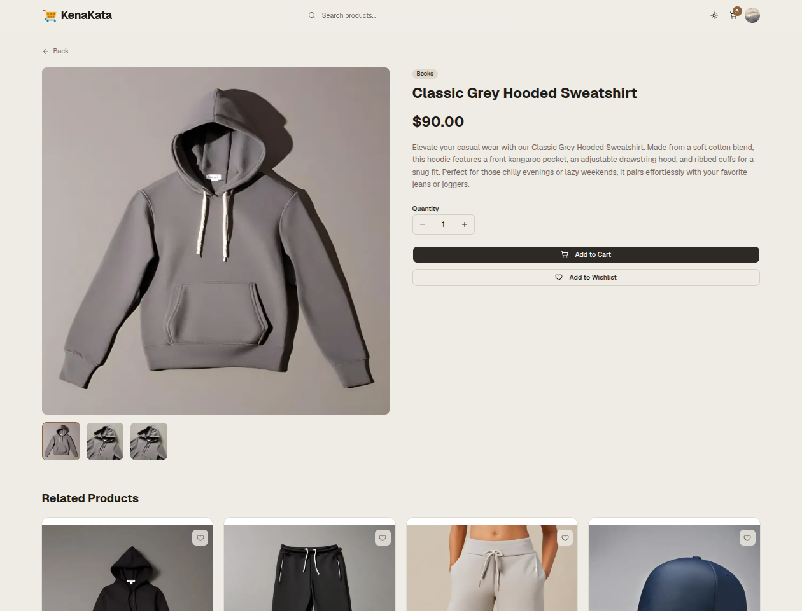
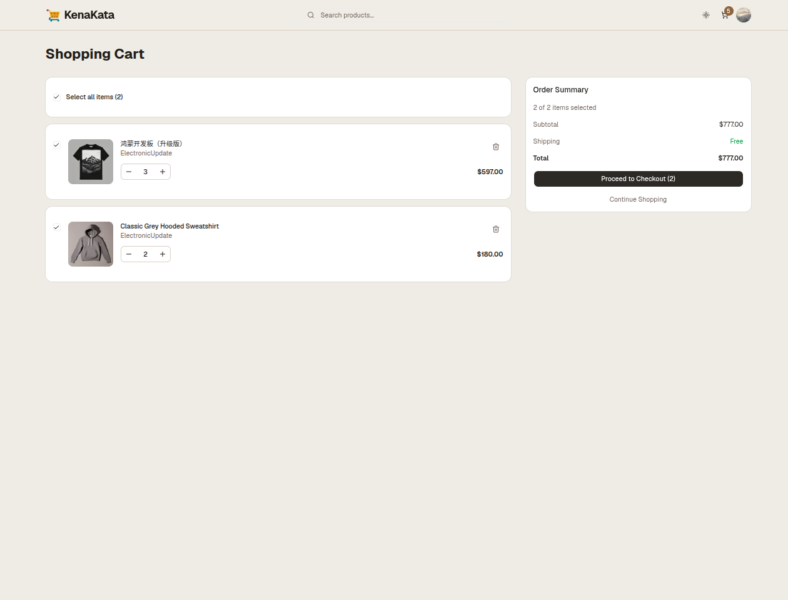
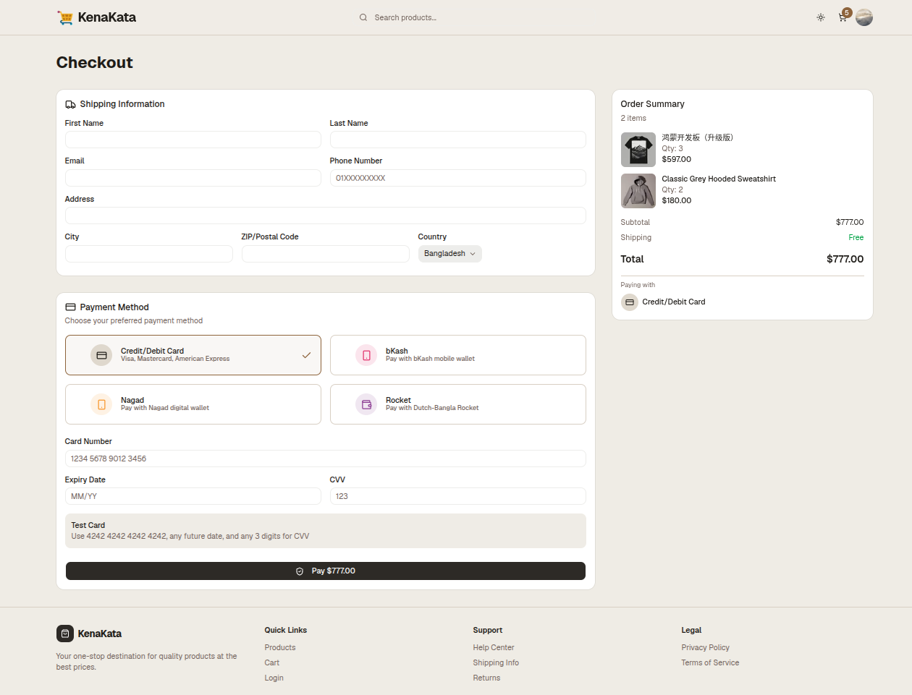
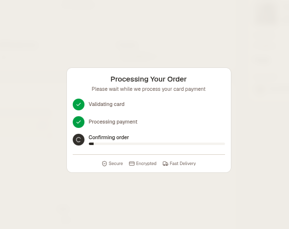
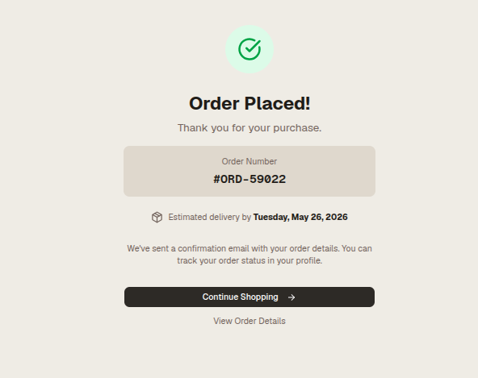
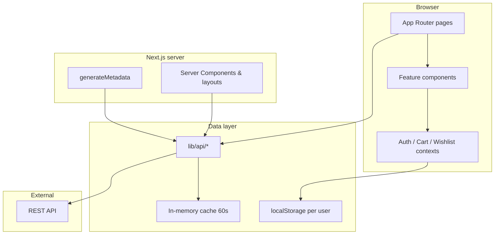

# KenaKata

**KenaKata** is a lifestyle and fashion e-commerce storefront built with Next.js. It covers the full shopping journey—browse, filter, authenticate, cart, wishlist, and checkout—with a UI tuned for clarity and performance. The frontend connects to an external REST API; checkout and payments are simulated for demonstration.

**Live demo:** https://e-kenakata.vercel.app/

---

## Screenshots

| Homepage (Hero Light) | Homepage (Hero Dark) |
| :---: | :---: |
|  |  |
| **Homepage (New Arrivals)** | **Homepage (Categories)** |
|  |  |
| **Catalog & Filters** | **Product Details** |
|  |  |
| **Shopping Cart** | **Checkout Flow** |
|  |  |
| **Payment Processing** | **Order Confirmation** |
|  |  |

---

## Getting Started

| Requirement | Detail |
| --- | --- |
| Runtime | Node.js 20+ |
| API | Backend reachable at `NEXT_PUBLIC_API_BASE_URL` |

```bash
npm install
```

Create `.env.local`:

```env
# Public API
NEXT_PUBLIC_API_BASE_URL=https://api.escuelajs.co/api/v1
```

```bash
npm run dev     # Development → http://localhost:3000
npm run build   # Production build
npm start       # Production server
```

**Scripts:** `npm run lint` — ESLint across the project.

---

## Project Overview

KenaKata is a **single-page-application-style storefront** on top of the Next.js App Router. The goal is a polished, production-shaped UX without a custom backend in this repo—the app consumes a REST API for catalog and auth while persisting cart and wishlist data locally per user.

### What the application does

**Discovery & catalog**

- **Homepage** — Hero, category grid, and “New Arrivals” fed from the API on the server.
- **Product listing** (`/products`) — Search (debounced), category filter, price range slider, sort, pagination, and shareable URLs (`?category=&search=&page=`).
- **Product detail** (`/products/[id]`) — Image gallery, quantity selector, add to cart, wishlist, and related products.

**Account**

- **Login / Register** — JWT auth against the API; tokens and profile stored in `localStorage`.
- **Profile** (`/profile`) — Edit name and avatar; mock order history for UI demonstration.
- **Session** — On load, validate access token via profile; refresh if expired; clear invalid sessions.

**Shopping**

- **Cart** (`/cart`) — Line items with quantity controls; select subset for checkout (requires login).
- **Wishlist** — Heart toggle on product cards; persisted per user in `localStorage`.
- **Checkout** (`/checkout`) — Shipping form, payment method (card, bKash, Nagad, Rocket), animated payment overlay, then redirect to order confirmation.
- **Order confirmation** — Displays order number and payment method from query params.

**Experience**

- Light / dark theme (`next-themes`).
- Route-level `loading.tsx` skeletons (products, cart, checkout, profile, etc.).
- Responsive layout from mobile through desktop.
- Accessible UI via Shadcn components (Radix primitives).

### Tech stack

| Category | Choices |
| --- | --- |
| Framework | Next.js 16 (App Router), React 19 |
| Language | TypeScript |
| Styling | Tailwind CSS v4, Shadcn UI |
| Forms & validation | `react-hook-form`, Zod 4 |
| Icons | Lucide React |
| Fonts | Geist Sans / Geist Mono (Google Fonts) |

### Route map

```
/                     → Homepage (Server Component, ISR)
/products             → Catalog with filters (Client)
/products/[id]        → Product detail (Client + server metadata layout)
/login, /register     → Auth forms
/cart                 → Cart (protected, Client)
/checkout             → Checkout (protected, Server shell + Client form)
/order-confirmation   → Post-checkout summary
/profile              → User profile (protected, Client)
```

---

## Architecture Explanation

The codebase is organized so **UI, routing, API access, and global state stay separate**. That makes it easier to swap the API host, add server rendering later, or test modules in isolation.

### High-level flow



### Directory responsibilities

| Path | Purpose |
| --- | --- |
| `app/` | Routes, nested layouts, metadata, and `loading.tsx` per segment |
| `components/products/` | Listing, filters, cards, detail gallery, search |
| `components/checkout/` | Shipping form, payment selector, overlay, order summary |
| `components/auth/` | Login, register, avatar upload |
| `components/layout/` | Navbar, footer |
| `components/ui/` | Shadcn primitives (Button, Form, Card, etc.) |
| `lib/api/` | Typed REST client—no React imports |
| `lib/*-context.tsx` | Global client state |
| `lib/hooks/` | `useDebounce`, product search helpers |

### API layer (`lib/api/`)

All HTTP calls go through a small, typed client:

- **`client.ts`** — Base URL from `NEXT_PUBLIC_API_BASE_URL` (throws if missing), in-memory cache (60s TTL), image URL sanitization.
- **`products.ts`** — List with filters (`title`, `categoryId`, `price_min` / `price_max`, `offset`, `limit`), get by id, related products.
- **`categories.ts`** — List and get by id.
- **`auth.ts`** — Login, profile, refresh token.
- **`users.ts`** — Registration and profile updates.

Server fetches use Next.js cache hints (`next: { revalidate: 60 | 300 }`). The same functions run on the client for interactive pages, with the in-memory cache reducing duplicate requests during a session.

### Global state (React Context)

Three providers wrap the app in `app/layout.tsx`:

1. **`AuthProvider`** — User, JWT tokens, login/register/logout, profile updates. Persists `auth_tokens` and `auth_user` in `localStorage`; sets a `user-session` cookie for lightweight hints.
2. **`CartProvider`** — Depends on auth. Cart is stored as `cart_{userId}` in `localStorage`. Add-to-cart requires a logged-in user; guests are redirected to login from product cards.
3. **`WishlistProvider`** — Same pattern as cart (`wishlist_{userId}`), using a `Set` of product IDs.

Contexts are intentionally separate so a cart quantity change does not re-render the entire auth tree.

### Forms and checkout

Checkout uses one **`react-hook-form`** instance with a **Zod schema** (`checkout-types.ts`). A `superRefine` block applies different rules for card vs. mobile wallet (Bangladeshi phone `01[3-9]…`, transaction ID length, card number length, MM/YY expiry). Payment UI simulates multi-step processing with `requestAnimationFrame` progress, then removes purchased items from the cart and redirects with query parameters.

### Protected routes

`ProtectedRoute` checks `useAuth()`: while loading, show skeletons; when unauthenticated, redirect to `/login`. Used for cart, checkout, and profile content.

Server-side route guarding is implemented in the Next.js `proxy.ts` file (the modern replacement for `middleware.ts`) to keep protected pages behind a cookie-based auth check before rendering.

---

## Rendering Strategy Decisions

Next.js supports static generation, server rendering, and client interactivity in the same app. KenaKata uses a **hybrid model**: server rendering where SEO and first paint matter; client rendering where filters, forms, and browser APIs dominate.

### Homepage — Server Component + ISR

`app/page.tsx` has no `"use client"`. It exports `revalidate = 60`, so the page is regenerated at most once per minute. Products and categories are fetched in parallel with `Promise.all` and rendered as HTML on the server. That gives fast first paint and crawlable content for the landing experience.

### Product listing & detail — Client Components

`/products` and `/products/[id]` are Client Components because they need:

- Debounced search and live filter updates
- URL query sync via `useRouter` / `useSearchParams`
- Pagination state without full page reloads
- Client-side sort (API has no `sort` parameter)

**Trade-off:** Users see skeletons until data arrives; filtered listing URLs are weaker for SEO than a server-rendered catalog.

### Product SEO — Server layout pattern

The detail **page** is a client component, but **`app/products/[id]/layout.tsx`** is a Server Component that implements `generateMetadata`. It fetches the product on the server and sets `<title>`, description, and Open Graph image before the client bundle hydrates. This is the standard App Router pattern when interactivity and metadata both matter.

### Checkout — Server page, client form

`app/checkout/page.tsx` exports static `metadata` and wraps content in `ProtectedRoute` + `Suspense`. The heavy form lives in `CheckoutContent` (client). The server shell handles SEO title and streaming fallback (`checkout/loading.tsx`).

### Loading UI

Almost every major route has a colocated `loading.tsx` (products, cart, checkout, profile, login, register, order confirmation). Next.js shows these automatically during navigations, improving perceived performance without custom spinner logic in each page.

### Where `"use client"` lives

Client boundaries are pushed toward **leaves**: `ProductCard`, filters, navbar, checkout fields, cart actions. The root layout remains a Server Component that only imports providers (which are client modules). That limits how much JavaScript ships and hydrates on mostly static views.

---

## Tradeoffs Made

Each decision below favored **speed of delivery and UX** over an ideal production setup. That is appropriate for a storefront demo backed by an external API.

### React Context instead of Redux / Zustand

**Chosen:** Three focused contexts (auth, cart, wishlist).

**Why:** No extra dependency; state shape is small and mostly tree-local.

**Cost:** As features grow, broad context updates can cause extra re-renders. Mitigation today: split providers and `useCallback` for stable handlers. A global store may be warranted if performance profiling shows issues.

### Client-side product listing vs. server-rendered catalog

**Chosen:** Full client fetch + filter state on `/products`.

**Why:** Instant filter/search UX and simple URL sync without wrestling `searchParams` on the server for every combination.

**Cost:** Slower meaningful first paint on listing pages; limited SEO for `?category=…&search=…` URLs. Homepage still carries SEO for the brand entry point.

### `localStorage` for cart and wishlist vs. API persistence

**Chosen:** Per-user keys in the browser (`cart_{id}`, `wishlist_{id}`).

**Why:** No cart/order endpoints required in the backend for the demo; cart works immediately after login.

**Cost:** No cross-device sync; clearing browser data loses the cart. Production would need server-side cart and order APIs.

### Client-only checkout validation

**Chosen:** Zod validation in the browser with immediate field errors.

**Why:** Best UX for multi-method payment forms; no round-trip per keystroke.

**Cost:** A real backend must re-validate everything on submit. Payment today is simulated—no PCI-compliant gateway.

### Client-side sorting

**Chosen:** Sort price low/high in JavaScript after fetch.

**Why:** The REST API does not expose sort query params.

**Cost:** Only the **current page** of results is sorted; total page count is estimated from result length, not a true `total` from the API.

### External REST API vs. embedded mock

**Chosen:** Real `fetch` to `NEXT_PUBLIC_API_BASE_URL` with sanitization and caching.

**Why:** Mirrors production integration; auth and catalog behave like a real deployment.

**Cost:** Requires a running API and env configuration; broken or slow API affects the whole app.

---

## Performance Considerations

### Images

`next/image` is used for product cards, galleries, hero, and categories. `next.config.ts` whitelists remote hosts (Unsplash, API CDNs, placeholders, avatars). Gallery and grid images set `sizes` and `quality` so the browser downloads appropriately sized assets and avoids layout shift (CLS).

### Network and caching

| Mechanism | Where | Effect |
| --- | --- | --- |
| `revalidate: 60` | Homepage + product fetches | Stale-while-revalidate on server |
| `revalidate: 300` | Categories | Less frequent category churn |
| In-memory cache | `lib/api/client.ts` | Dedupes repeated client calls within 60s |
| Debounce 500ms | Product search | Fewer API calls while typing |
| Pagination `limit: 12` | Listing | Smaller payloads per request |

### JavaScript and hydration

- Client components are scoped to interactive regions.
- `Suspense` on checkout and product listing streams fallbacks immediately.
- Homepage ships mostly HTML from the server with minimal client JS for that route.

### Perceived performance

- Skeleton components mirror final layout (filters, product grid, checkout).
- Concurrent `Promise.all` on the homepage avoids waterfall requests.
- Payment overlay uses `requestAnimationFrame` for smooth progress without blocking the main thread on timers alone.

### Auth and cart load

Cart and wishlist read `localStorage` after `user` is known, exposing `isLoading` until hydration completes so the UI does not flash empty then full.

---

## Challenges Faced

These are the main problems encountered during development and how they were addressed—useful when explaining design decisions in reviews or interviews.

### 1. SEO metadata on client-only pages

**Problem:** Next.js does not allow `export const metadata` or `generateMetadata` in files marked `"use client"`. Product detail needs rich client behavior (gallery, cart, wishlist) but also unique titles and Open Graph tags per product.

**Solution:** Keep `app/products/[id]/page.tsx` as a Client Component; add a sibling **server** `layout.tsx` that runs `generateMetadata` and fetches product data only for meta tags.

**Outcome:** Crawlers and social previews get correct metadata; users still get a fully interactive product page.

### 2. One checkout form, four payment methods

**Problem:** Card payments need number, expiry, and CVV. Mobile wallets (bKash, Nagad, Rocket) need a Bangladeshi mobile number and transaction ID. Duplicating forms creates maintenance risk; a single schema with optional everything validates nothing correctly.

**Solution:** One Zod object with `superRefine` branching on `paymentMethod`, and `form.watch("paymentMethod")` so the UI shows the right fields when the user switches methods.

**Outcome:** Single source of truth for validation and UI; switching payment method updates both visible fields and rules.

### 3. Formatted inputs vs. `react-hook-form` state

**Problem:** Card numbers and phone numbers are easier to read with spaces and masks, but validators expect normalized values (digits only, fixed lengths).

**Solution:** Formatter helpers (`formatCardNumber`, `formatExpiry`, `formatMobileNumber`) in `checkout-types.ts`, applied in controlled inputs while the form stores the formatted or stripped values consistently.

**Outcome:** Users see friendly input; Zod rules stay predictable.

### 4. Hybrid rendering: marketing vs. catalog

**Problem:** Homepage benefits from SSR/ISR; catalog benefits from instant client filters. One approach cannot optimize both equally.

**Solution:** Server homepage with `revalidate = 60`; client catalog with debounce, URL sync, and skeletons.

**Outcome:** Strong landing-page performance; acceptable trade-off on listing SEO until a server-driven filter page is built.

### 5. Unreliable product images from the API

**Problem:** Some API responses include malformed URLs, deprecated hosts, or broken paths, which break galleries and cards.

**Solution:** `sanitizeImageUrl` and `sanitizeProduct` at the API boundary, with a local placeholder fallback.

**Outcome:** UI degrades gracefully instead of showing broken images across the store.

### 6. Auth hydration and protected routes

**Problem:** On first paint, `localStorage` may contain tokens that are expired or invalid. Protected pages must not flash checkout/cart content before redirecting guests.

**Solution:** `AuthProvider` runs an async init: load tokens → `getProfile` → `refreshToken` on failure → clear storage if still invalid. `ProtectedRoute` renders skeletons until `isLoading` is false, then redirects unauthenticated users.

**Outcome:** Smoother session restore; fewer “flash of wrong content” bugs.

### 7. Responsive hero clipping CTAs

**Problem:** A fixed hero height hid primary buttons on smaller viewports.

**Solution:** Replace rigid height with responsive `min-h` breakpoints and flexible layout (`min-h-[450px]` → `lg:h-[66vh]`).

**Outcome:** Hero remains visual on desktop without sacrificing mobile usability.

### 8. Pagination without total count from API

**Problem:** The listing API returns a page of products but not always a reliable total count; sort is not server-side.

**Solution:** Estimate “has more” from page size; sort current page in the client.

**Outcome:** Works for demos; documented limitation until the API exposes `total` and `sort`.

---

## Future Improvements

Prioritized directions if this storefront moves toward production:

| Priority | Improvement | Rationale |
| --- | --- | --- |
| High | Server-rendered catalog with `searchParams` | Better SEO and first paint on `/products` |
| High | Backend cart, wishlist, and orders | Cross-device sync; real order history on profile |
| High | Real payment integration (Stripe + local wallets) | Replace simulated payment flow |
| Medium | API: sort, filter metadata, `total` count | Remove client-side sort hacks and page guessing |
| Medium | Server Actions for checkout submit | Re-validate Zod on server; secure order creation |
| Medium | `.env.example` and deployment docs | Onboard developers without guessing env vars |
| Lower | Zustand (or similar) if Context re-renders grow | Scale global state with less boilerplate |
| Lower | Playwright / Cypress E2E | Cover login → cart → checkout regression paths |
| Lower | Error boundaries and API error UI | Replace `console.error` with user-facing retry states |

---


## License

Private project (`"private": true` in `package.json`). Adjust as needed for your deployment.
